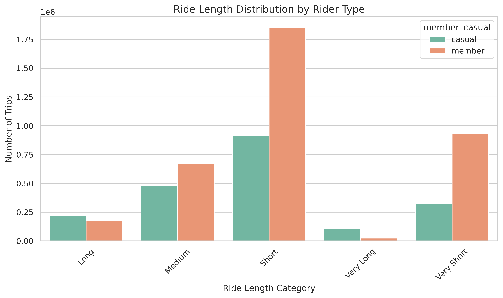
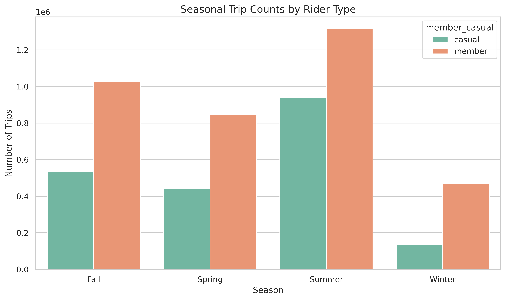

## 🔍 Business Question

How do annual members and casual riders use Cyclistic bikes differently?

## 📂 Data

The data were taken from the cyclistic bike share from January to December 2023. The total of the rows is 5849135 rows. There are 13 columns obtained from the raw data: `ride_id`, `rideable_type`, `started_at`, `ended_at`, `start_station_name`, `start_station_id`, `end_station_name`, `end_station_id`, `start_lat`, `start_lng`, `end_lat`, `end_lng` and `member_casual`.  

## 🛠️ Tools Used

- **PostgreSQL 18** - data storage, cleaning and analysis with SQL.
- **Python (pandas, seaborn, matplotlib)** - analysis and visualization.
- **Tableau public** - map visualization.
- **Jupyter notebook** - platform to run Python.

## 🧹 Data Cleaning & Preparation

Data cleaning and preparation were mainly done in PostgreSQL 18. After the analysis was completed, the outputs were exported in the form of CSV files.

The step of data cleaning and preparation from the beginning to the end:
1. Checked 12-month data of Cyclistic bike share 2023 (January-December) CSV files. The time format "started_at" and "ended_at" were changed to (yyyy-mm-dd hh:mm:ss). All of the `start_lat`, `start_lng`, `end_lat`, `end_lng` were ensured in the number format. Erased ' in some of the data. 
2. Imported the data into PostgreSQL 18 and created a single table. 
3. Created `ride_length` from the subtraction of `ended_at` and `started_at` in minutes.
4. Added `day_of_week` feature.
5. Cleaned the data which consists of:
   - Removed trips with zero and negative duration.
   - Erased impossibly long trips.
6. Added new features: `month` and `season` (spring, summer, fall or winter) based on the ride date.
7. Continues to data analysis with SQL. 

## 📊 Analysis Overview

### 2. Member vs Casual Behaviour

**2.1 Average ride length**

The average ride length in minutes was compared between members and casual riders to observe the average duration for each category. This feature will allow us to gather information on which riders use the cyclistic longer. 

**2.2 Ride length distribution**

The trips were grouped into several categories:
- < 5 minutes: very short
- < 15 minutes: short
- < 30 minutes: medium
- < 60 minutes: long
- > 60 minutes: very long

After the categories of the trip were made, the distribution of the ride length between members and casual riders was compared. 

**2.3 Variability (standard deviation)**

The **standard deviation** of `ride_length` was calculated to see the variability of the data of members and casual riders. 

### 3. Time-Based Behaviour

**3.1 Hour of day**

The hour of the rides was observed to see the pattern of commuting peaks and leisure of members and casual riders. 

**3.2 Day of week**

The visualisation of the day of week with respect to the number of trips for members and casual riders. It aims to visualise the habits of members and casual riders in using Cyclistic in each day. 

### 4. Seasonal Trends

**4.1 Seasonal trip counts**

The evolution of the trips along the season in 2023 of members and casual riders. 

**4.2 Average ride length by season**

### 5. Monthly Trends

### 6. Station Popularity

**6.1 Most popular stations overall**

**6.2 Top stations among members**

**6.3 Top stations among casual riders**

### 7. Geographic Insights

With Tableau, the density-style map and the top 3 most popular stations in the map were created. `start lat`, `start lng`, `end lat` and end lng` were used for constructing the density-style map in Tableau. 
